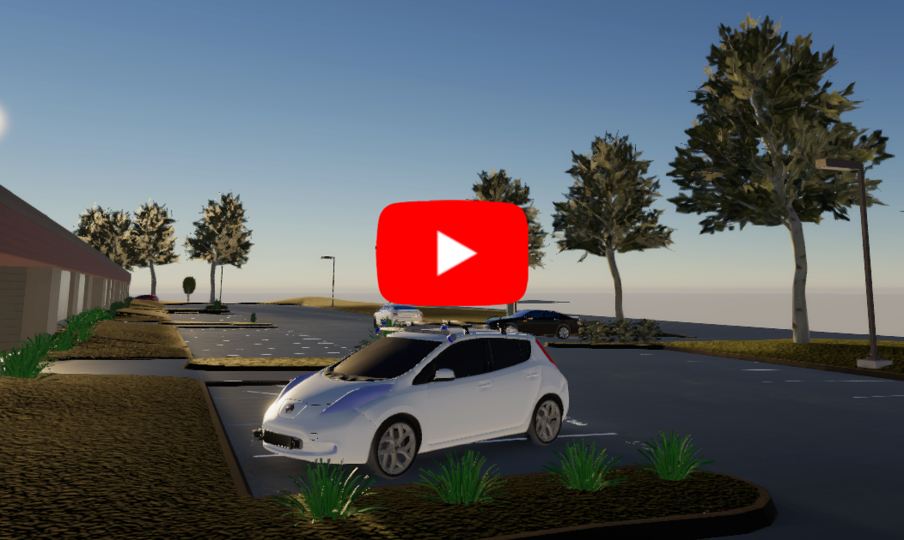

# lgsvl Nissan Leaf ROS auxiliaries
This ROS package (`lgsvl_nissanleaf_ros`) aims to provide additional launch files and nodes to make it easier to work with lgsvl and ROS.

## Usage

In order to create `/current_pose` from `/odom` simply run:
```
rosrun lgsvl_nissanleaf_ros odom_to_pose.py
```

There are 3 default locations which can be simulated as:
```
rosparam set lgsvl_location zala
rosparam set lgsvl_location gyor
rosparam set lgsvl_location zero
rosrun lgsvl_nissanleaf_ros odom_to_pose.py
```
To start the static + dynamic trasforms and the bridge (in case of Windows), run:
```
roslaunch lgsvl_nissanleaf_ros tf_bridge.launch
```

To start the static + dynamic trasforms, the vehicle model and the bridge (in case of Windows), run:
```
roslaunch lgsvl_nissanleaf_ros tf_model_bridge.launch
```

To start the static + dynamic trasforms, and the 3D vehicle model:
```
roslaunch lgsvl_nissanleaf_ros tf_model.launch
```

## Dependencies
- [lgsvl_msgs](https://github.com/lgsvl/lgsvl_msgs) LGSVL related ROS message types, clone and build in the catkin workspace
- [rosbridge-server](http://wiki.ros.org/rosbridge_server) simply install with `sudo apt install ros-$ROS_DISTRO-rosbridge-server`
- [nissan_leaf_ros](https://github.com/szenergy/nissan_leaf_ros)/nissan_brigup contains the 3D rviz model (optional for visualization in RVIZ)
- [autoware.ai](https://github.com/Autoware-AI/autoware.ai) optional if the control is done with autoware MPC realization 

## Install ROS dependencies

It is recommended to use catkin build instead of catkin_make, but it is not obilgatory. 
```
sudo apt update
sudo apt install python-catkin-tools
```

Initiialize catkin workspace if not yet done (`~/catkin_ws` is assumed).
```
mkdir ~/catkin_ws
cd ~/catkin_ws
mkdir src
catkin init
echo "source ~/catkin_ws/devel/setup.bash" >> ~/.bashrc
```

Clone the dependencies to the catkin workspace.
```
cd ~/catkin_ws
rosdep install --from-paths src --ignore-src
cd ~/catkin_ws/src
git clone https://github.com/lgsvl/lgsvl_msgs
git clone https://github.com/ros-drivers/velodyne
git clone https://github.com/szenergy/nissan_leaf_ros #optional
```

Build and don't forget to source bashrc.
```
catkin build lgsvl_msgs nissanleaf-lgsvl velodyne
source ~/.bashrc
```

Install rosbridge-server.
```
sudo apt install ros-$ROS_DISTRO-rosbridge-server
```

# Notes

Install `v0.1-beta` on windows:
<p align="center">
    <a hfref="https://www.youtube.com/watch?v=EH_U3JtfVO4"></a>
</p>